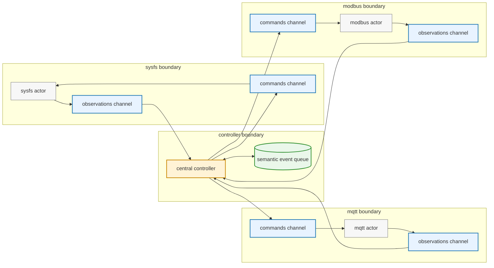

# Distributed Light Model

## Purpose

This note captures the naming and routing direction for distributed light control.
It is the design reference for implementation plan phase 7.
See [Home Automation Landscape](home-automation-landscape.md) for the broader system comparison that motivates the transport capability and binding execution strategy choices.

The immediate goal is to let `nest` represent cross-unit light control cleanly before Modbus execution exists.
The longer-term goal is to let sysfs, MQTT, and Modbus act as transport actors behind the same controller-level semantic model.

## Core Direction

The domain model should use globally unique semantic entity IDs.
Those IDs should be separate from actor-local transport addresses.
The canonical configuration should describe the whole installation as one global tree.

We will use a hardware-unit-rooted naming scheme rather than a house-location-rooted one.

Preferred shape:

```text
hardware_unit.entity_type.entity_name
```

Examples:

- `panel_1.button.entry_left`
- `panel_1.light.entry`
- `panel_1.relay.entry`
- `garage_io.cover.main_door`

This keeps IDs globally unique while matching the physical ownership boundary of the system.

## Naming Layers

There are three distinct layers.

### 1. Semantic Global IDs

These identify domain entities.
They are stable across transports and should be used by bindings, controller logic, MQTT discovery payload generation, and cross-unit references.
In the global config tree, these IDs are derived from the owning unit, the entity section, and the local bare ID.

Examples:

- `panel_1.button.entry_left`
- `garage_io.light.driveway`

These IDs answer:

```text
What thing is this?
```

### 2. Actor-Local Addresses

These identify how one actor talks to a local integration endpoint.
They are not the primary domain identity.
In the global config tree, these addresses live under unit-local actor sections such as `units.<unit>.actors.sysfs`.

Examples:

- sysfs device IDs such as `di_3_16` and `ro_3_14`
- future Modbus coil addresses
- MQTT topics

These addresses answer:

```text
How does this actor reach it?
```

### 3. Routing Resolution

Routing decides how a semantic entity is reached from the current unit.
This should be handled by registry or index lookups built from configuration.
It should not be hard-coded into controller logic and should not require transport-specific details to leak into semantic IDs.

Routing answers:

```text
Where does the command go next?
```

## Why This Split

This avoids coupling the domain model to a single transport.
It also avoids mixing transport ownership and addressing concerns directly into semantic entity definitions.

That matters because:

- Modbus should become another actor rather than a special case in the light model.
- MQTT should also be able to carry cross-unit commands when that is the right routing path.
- the controller should operate on semantic entities and resolved command targets rather than on transport-specific identifiers.

## Ownership Convention

The leading hardware-unit segment in the semantic ID indicates the owning unit namespace.
For example, `garage_io.light.driveway` belongs to the `garage_io` unit namespace.

This is a naming convention first.
The global config tree should make that ownership explicit structurally as well.
We should avoid pushing too much routing logic into string parsing beyond the owning-unit prefix unless there is a concrete need.

## Config Direction

Configuration should eventually express shared actor config, unit-local actor resources, and semantic entities in one global tree.

Preferred top-level structure:

```text
actors
units
bindings
```

Where:

- `actors` contains shared actor configuration when it is truly shared across units
- `units` contains unit-local actor resources and semantic entities
- `bindings` contains house-wide behavior and cross-unit relationships

Per-unit actor participation should be explicit.
We should avoid inheritance or implicit enablement rules.

Within typed sections, local references should use bare IDs.
The surrounding unit and section provide the namespace and type context.

Semantic entities should not point directly at actor-local addresses such as sysfs device IDs or Modbus coil addresses.
Instead, entities should use explicit typed endpoint references when they need to bind to an actor-local resource.
The shared endpoint reference shape is:

```yaml
actor: sysfs
kind: relay
id: entry_ceiling
```

The `actor` field names the unit-local actor section that owns the resource.
The `kind` field names the resource kind within that actor.
The `id` field is the bare resource ID inside that actor section.

Entity fields decide the role and cardinality of those references.
For example, a button has one `input`, a light has one `actuator`, and a cover will likely have separate `open_actuator` and `close_actuator` references.
This keeps semantic entities explicit without encoding actor, kind, and resource structure in a string naming convention.

Illustrative direction:

```yaml
actors:
  mqtt:
    broker:
      host: localhost
      port: 1883
      topic_prefix: nest

units:
  panel_1:
    actors:
      mqtt:
        enabled: true
      sysfs:
        digital_inputs:
          - id: entry_left
            device: di_3_16
          - id: entry_right
            device: di_3_17
        relays:
          - id: entry_ceiling
            device: ro_3_14
      modbus:
        role: master
        port: /dev/ttyNS0
        baudrate: 19200

    entities:
      buttons:
        - id: entry_left
          input:
            actor: sysfs
            kind: digital_input
            id: entry_left
        - id: entry_right
          input:
            actor: sysfs
            kind: digital_input
            id: entry_right
      lights:
        - id: entry
          actuator:
            actor: sysfs
            kind: relay
            id: entry_ceiling

  garage_io:
    actors:
      mqtt:
        enabled: true
      sysfs:
        relays:
          - id: driveway
            device: ro_2_01
      modbus:
        role: slave
        port: /dev/ttyNS0
        baudrate: 19200
        timeout: 5ms
        unit_id: 1
        coils:
          - id: driveway
            address: 1
            target:
              actor: sysfs
              kind: relay
              id: driveway

    entities:
      lights:
        - id: driveway
          actuator:
            actor: sysfs
            kind: relay
            id: driveway

bindings:
  - source: panel_1.button.entry_left
    target: panel_1.light.entry
    action: toggle
  - source: panel_1.button.entry_right
    target: garage_io.light.driveway
    action: toggle
```

This example is directional rather than final schema.
It shows the intended layering:

- shared actor configuration stays out of unit blocks when it is global
- unit blocks own local actor resources and semantic entities
- semantic IDs are globally unique after unit and section qualification
- semantic entities reference actor-local resources through typed endpoint references
- local hardware mapping stays explicit inside actor resource sections
- bindings target semantic entities rather than raw transport addresses

Derived fully qualified semantic IDs from the example include:

- `panel_1.button.entry_left`
- `panel_1.button.entry_right`
- `panel_1.light.entry`
- `garage_io.light.driveway`

Local actor resource IDs remain local to their unit and actor section.
For example, `panel_1` can refer to sysfs relay `entry_ceiling` through `{actor: sysfs, kind: relay, id: entry_ceiling}` without exposing the sysfs device address to the semantic light.
The actor section still owns the final device address such as `ro_3_14`.

This same endpoint reference shape should be reused for other semantic entities.
For example, a future cover entity can use two typed actuator references:

```yaml
entities:
  covers:
    - id: main_window
      open_actuator:
        actor: sysfs
        kind: relay
        id: main_window_up
      close_actuator:
        actor: sysfs
        kind: relay
        id: main_window_down
```

## Runtime Direction

The controller should continue to normalize actor observations into semantic events.
It should also resolve semantic targets into transport-specific commands through registries or indexes.
Those registries or indexes should be built from the global config tree or from a unit-local projection derived from it.

For now, each running `nest` process should be told explicitly which unit it is responsible for.
The simplest initial approach is a positional CLI argument such as:

```text
nest <unit_id> --config config.yaml
```

That keeps unit selection explicit without introducing a separate bootstrap config or remote config dependency yet.
Startup can then load the canonical global config, select `units.<unit_id>`, and build the local runtime projection from that unit subtree plus the relevant shared actor config and bindings.

That means future execution should conceptually look like this:

```text
sysfs observation
  -> semantic button event
  -> semantic light command
  -> resolved command target
  -> sysfs or MQTT or Modbus actor command
```

The controller should not need separate event models for local and remote lights.
The difference should emerge from resolution and routing.

Within one unit, local references should remain short and section-scoped.
At runtime, those local references are resolved to fully qualified semantic IDs and actor-local addresses through the owning unit context.

### Controller Actor Boundary

Each running `nest` process should keep actors connected only to the central controller.
Actors exchange observations and commands with the controller through async channel pairs.
The controller owns the local semantic event queue, where normalized observations and derived semantic events are dispatched.



### Multi-Controller Boundary

Each controller has its own local semantic event queue.
Remote behavior is represented by projected binding views on both sides of the transport boundary.
Binding and routing translation is controller policy, not an actor.
It consumes semantic events from the queue and emits derived semantic events back into that queue.
The central controller then turns those semantic events into actor commands when needed.

```mermaid
flowchart LR
    classDef actor fill:#f7f7f7,stroke:#777,stroke-width:1px
    classDef channel fill:#e8f3ff,stroke:#1f77b4,stroke-width:2px
    classDef controller fill:#fff3d6,stroke:#c98500,stroke-width:2px
    classDef semantic fill:#eaf7ea,stroke:#2f8f2f,stroke-width:2px
    classDef binding fill:#fff8e8,stroke:#d08a00,stroke-width:2px
    classDef transport fill:#ffecec,stroke:#c43d3d,stroke-width:2px

    subgraph c1["controller_1 runtime"]
        direction TB
        subgraph c1_sysfs_boundary["sysfs boundary"]
            direction TB
            c1_sysfs["sysfs actor"]:::actor
            c1_sysfs_events["observations channel"]:::channel
            c1_sysfs_commands["commands channel"]:::channel
        end

        subgraph c1_transport_boundary["transport boundary"]
            direction TB
            c1_transport["transport actor"]:::transport
            c1_transport_events["observations channel"]:::channel
            c1_transport_commands["commands channel"]:::channel
        end

        subgraph c1_controller_boundary["controller boundary"]
            direction TB
            c1_controller["central controller"]:::controller
            c1_queue[("semantic event queue")]:::semantic
            c1_source["binding/routing policy<br/>source-local view<br/>local source, remote target"]:::binding
        end

        c1_sysfs --> c1_sysfs_events --> c1_controller
        c1_controller --> c1_sysfs_commands --> c1_sysfs
        c1_transport --> c1_transport_events --> c1_controller
        c1_controller --> c1_transport_commands --> c1_transport
        c1_controller <--> c1_queue
        c1_queue --> c1_source
        c1_source -- "emit remote-source event" --> c1_queue
        c1_queue --> c1_controller
    end

    subgraph link["transport link"]
        direction LR
        wire["MQTT or Modbus"]:::transport
    end

    subgraph c2["controller_2 runtime"]
        direction TB
        subgraph c2_sysfs_boundary["sysfs boundary"]
            direction TB
            c2_sysfs["sysfs actor"]:::actor
            c2_sysfs_events["observations channel"]:::channel
            c2_sysfs_commands["commands channel"]:::channel
        end

        subgraph c2_transport_boundary["transport boundary"]
            direction TB
            c2_transport["transport actor"]:::transport
            c2_transport_events["observations channel"]:::channel
            c2_transport_commands["commands channel"]:::channel
        end

        subgraph c2_controller_boundary["controller boundary"]
            direction TB
            c2_controller["central controller"]:::controller
            c2_queue[("semantic event queue")]:::semantic
            c2_target["binding/routing policy<br/>target-local view<br/>remote source, local target"]:::binding
        end

        c2_sysfs --> c2_sysfs_events --> c2_controller
        c2_controller --> c2_sysfs_commands --> c2_sysfs
        c2_transport --> c2_transport_events --> c2_controller
        c2_controller --> c2_transport_commands --> c2_transport
        c2_controller <--> c2_queue
        c2_queue --> c2_target
        c2_target -- "emit light action" --> c2_queue
        c2_queue --> c2_controller
    end

    c1_transport --> wire --> c2_transport
```



### Cross-Unit Toggle Flow

The global config describes the behavior once, but each running unit evaluates the part of that behavior relevant to itself.
Actors and controller layers communicate through async channels.
For a remote light toggle, the source-owning unit turns a local hardware observation into a semantic event, evaluates the source-local binding view, and sends a transport command.
The target-owning unit receives the transport observation, turns it back into a semantic event, evaluates the target-local binding view, and resolves the derived semantic light action to local actuator output.

```mermaid
flowchart TD
    classDef actor fill:#f7f7f7,stroke:#777,stroke-width:1px
    classDef channel fill:#e8f3ff,stroke:#1f77b4,stroke-width:2px
    classDef controller fill:#fff3d6,stroke:#c98500,stroke-width:2px
    classDef semantic fill:#eaf7ea,stroke:#2f8f2f,stroke-width:2px
    classDef command fill:#f4e8ff,stroke:#7a3db8,stroke-width:2px
    classDef transport fill:#ffecec,stroke:#c43d3d,stroke-width:2px

    subgraph c1["controller_1"]
        di["actor observation<br/>sysfs digital input<br/>di_3_16 rising"]:::actor
        state_changes["async channel<br/>stateChanges"]:::channel
        normalize["controller layer<br/>normalizer"]:::controller
        semantic1["async channel<br/>semanticEvents"]:::channel
        button["semantic message<br/>controller_1.button.office_button pressed"]:::semantic
        source_binding["controller layer<br/>source-local binding view<br/>target: controller_2.light.hall_light<br/>action: toggle"]:::controller
        transport_commands["async channel<br/>transport commands"]:::channel
        outbound["actor command<br/>publish or write source event"]:::command

        di --> state_changes
        state_changes --> normalize
        normalize --> button
        button --> semantic1
        semantic1 --> source_binding
        source_binding --> transport_commands
        transport_commands --> outbound
    end

    transport["transport actor<br/>MQTT or Modbus"]:::transport

    subgraph c2["controller_2"]
        inbound["actor observation<br/>received source event"]:::actor
        transport_events["async channel<br/>transport events"]:::channel
        normalize_remote["controller layer<br/>normalizer"]:::controller
        semantic2["async channel<br/>semanticEvents"]:::channel
        remote_event["semantic message<br/>controller_1.button.office_button pressed"]:::semantic
        target_binding["controller layer<br/>target-local binding view<br/>source matches remote event"]:::controller
        light_action["semantic message<br/>controller_2.light.hall_light toggle"]:::semantic
        sysfs_commands["async channel<br/>sysfs commands"]:::channel
        relay["actor command<br/>sysfs relay ro_3_14 toggle"]:::command

        inbound --> transport_events
        transport_events --> normalize_remote
        normalize_remote --> remote_event
        remote_event --> semantic2
        semantic2 --> target_binding
        target_binding --> light_action
        light_action --> sysfs_commands
        sysfs_commands --> relay
    end

    outbound --> transport
    transport --> inbound
```



The implementation plan tracks current phase-7 progress.
This document describes the intended model rather than active task status.

## Binding Execution Strategies

Bindings describe semantic relationships between entities.
They should not assume that the unit which observes the source also executes the target action.

Example:

```yaml
bindings:
  - source: panel_1.button.entry_right
    target: garage_io.light.driveway
    action: toggle
```

This means:

```text
when panel_1.button.entry_right triggers, apply toggle to garage_io.light.driveway
```

It does not by itself decide whether `panel_1` sends a command to `garage_io`, or whether `garage_io` observes the source event and executes the action locally.

There are at least three execution strategies.

### 1. Local Execution

When source and target are owned by the same unit, the owning unit can evaluate and execute the binding locally.

```text
panel_1 button event
  -> panel_1 binding evaluation
  -> panel_1 light action
  -> panel_1 local actor command
```

This is the current implemented path for local sysfs-backed lights.

### 2. Pub/Sub Event Replication

When a transport can publish semantic events to interested units, the source-owning unit can publish source events and the target-owning unit can evaluate bindings that target its local entities.

MQTT fits this pattern well.

```text
panel_1 observes panel_1.button.entry_right pressed
  -> panel_1 publishes the semantic button event
  -> garage_io receives the source event because a binding targets garage_io.light.driveway
  -> garage_io evaluates the binding
  -> garage_io resolves toggle against local driveway state
  -> garage_io executes the local actuator command
```

This avoids sending remote `TOGGLE` commands.
The target-owning unit keeps authority over its own state and translates semantic actions such as `toggle` into concrete local effects.

This also matches the way MQTT naturally works as a publish/subscribe bus.
The source event can be observed by multiple interested target units without the source unit knowing every transport detail of every target.

### 3. Command Routing

Some transports do not support symmetric event publication.
Modbus RTU is the important example because a slave does not spontaneously publish events to the bus.

For Modbus-backed remote control, the source-side unit may need to initiate the bus transaction through a Modbus master actor.
That does not necessarily mean the source-side unit must resolve the final semantic action itself.

There are two useful Modbus interpretations.

#### Event Signal Writes

The existing `modbusbackup` setup effectively uses Modbus writes as event delivery.
The source-side unit observes an input event and writes a configured coil on the target-side slave.
The target-side unit treats that incoming write as a trigger, reads its local output state, and applies the semantic action locally.

```text
panel_1 button event
  -> panel_1 Modbus master writes event coil on garage_io
  -> garage_io Modbus slave receives the write
  -> garage_io treats the write as a source event or trigger
  -> garage_io resolves toggle against local driveway state
  -> garage_io executes the local actuator command
```

In this mode, the Modbus coil does not represent the final light state.
It represents a source event or trigger delivered through a master-initiated transport.
This preserves target-side state authority while fitting Modbus RTU's master/slave mechanics.

#### Concrete Command Writes

Modbus can also expose concrete actuator or state control points.
In that mode, the source-side unit evaluates the binding and writes the resulting concrete value through the Modbus master actor.

```text
panel_1 button event
  -> panel_1 binding evaluation
  -> panel_1 resolves a remote target route
  -> panel_1 Modbus master writes a remote actuator or coil
```

This route may require state knowledge on the source side if the semantic action is state-dependent.
For example, resolving `toggle` into `ON` or `OFF` requires a current-enough view of the target state unless the target-side protocol explicitly supports semantic toggle actions.

### Consequences

Bindings should remain transport-independent semantic rules.
Projection should decide which bindings and source events are relevant to a unit.
Actor capabilities should influence whether a binding is executed locally, through event replication, or through command routing.

For MQTT, a likely direction is target-side execution from replicated semantic source events.
For Modbus, the existing backup setup suggests a first direction where master writes deliver event signals to a target-side slave, and the target-side unit still resolves the action locally.
Concrete Modbus command routing remains useful for transports or entities that expose actuator state directly.

This means phase 7 should represent remote bindings without committing to one universal routing strategy.
Later transport phases can implement the appropriate execution strategy per actor.

## Modbus Transport Direction

The current distributed light model has to fit the existing hardware topology.
Changing the hardware layout is out of scope for the initial migration.

In particular:

- we should not require a new dedicated Modbus master device
- we should not require a central network-dependent command router
- cross-unit light migration should still work on the existing RS-485 capable units

### Core Observation

Modbus RTU is not a symmetric peer-to-peer transport in the same way MQTT is.

At the protocol level:

- a master initiates requests
- a slave responds to requests
- a slave does not spontaneously publish events on the bus

That means Modbus fits the actor model, but not as a symmetric actor role.

### Actor Model Fit

The Modbus integration should still use the same runtime boundary pattern as other actors:

- one command channel into the actor
- one event channel back out of the actor

Internally, the Modbus actor can run in one of these roles:

- master only
- slave only
- both later if a concrete use case requires it

The controller-facing contract should stay the same regardless of the internal role.

### Planned Role Split

For the current migration path, units may take different Modbus roles depending on what they need to do.

#### Master Role

The master side is responsible for:

- consuming resolved controller commands that target remote actuators
- issuing Modbus RTU requests to remote units
- reporting write failures, connection issues, and similar transport outcomes back to the controller

#### Slave Role

The slave side is responsible for:

- exposing local relay or actuator control points over Modbus RTU
- receiving writes from a master
- turning those writes into local actuator effects or controller-visible observations

### Semantic Model Versus Transport Role

Units remain equal at the semantic level.
Any unit may own local buttons, lights, relays, or covers.
That semantic ownership is described in the unit subtree and does not depend on the Modbus role used at runtime.

Units are not necessarily equal at the Modbus transport-role level.
One unit may need to act as a Modbus master for a given deployment, while another acts as a slave.

This distinction is important:

- semantic ownership belongs in the domain model
- master or slave behavior belongs in actor runtime configuration

### Modbus Role Versus Semantic Direction

Modbus master/slave roles describe bus transaction authority, not semantic ownership.
A Modbus master initiates every bus request.
A Modbus slave only responds to requests and exposes an address space.
This means a slave can still be the semantic owner of a light, button, or state value, but it cannot publish that information independently on the bus.

For `nest`, source and target remain semantic concepts.
Source-local means the unit owns the semantic event source.
Target-local means the unit owns the semantic behavior target.
Modbus master means the unit initiates reads and writes on the RS-485 bus.
Modbus slave means the unit exposes readable or writable points on the RS-485 bus.
These concepts should not be collapsed into one naming layer.

A practical deployment may have one unit in Modbus master mode and other units in Modbus slave mode.
The master unit may still have local sysfs inputs, relays, and semantic entities.
It should not need to be a dedicated transport-only node.

The same fixed master/slave bus topology can still carry bidirectional semantic information.
The master can write event signals or commands to slaves.
The master can also poll slaves for state, events, or diagnostics.

An event signal is a command-like trigger endpoint exposed by a slave.
It does not represent final light or relay state.
It means that when the master writes the endpoint, the slave should treat the write as an incoming semantic trigger and apply the configured local behavior.
For example, a written event signal may mean that a remote button event happened, and the target-owning slave should resolve the toggle against its own local light state.

The slave-side declarations describe what the slave exposes.
The master-side declarations describe what the master uses.

Initial concepts are:

| Concept            | Declared by | Used by                   | Bus operation       |
| ------------------ | ----------- | ------------------------- | ------------------- |
| Event signal       | Slave       | Master event-signal write | Master writes slave |
| State point        | Slave       | Master state poll         | Master reads slave  |
| Event-signal write | Master      | Slave event signal        | Master writes slave |
| State poll         | Master      | Slave state point         | Master reads slave  |

There is no direct slave-to-master write route.
If a slave needs to make information available to the master, it exposes a readable point and the master polls it.
A later event queue or event point would still follow the same pattern: the slave exposes it, and the master reads it.

Initial abstract route classes are:

| Route class        | Modbus transaction        | Semantic direction                                               |
| ------------------ | ------------------------- | ---------------------------------------------------------------- |
| Event signal write | master writes slave point | master-observed source event reaches slave-owned target behavior |
| State poll         | master reads slave point  | slave-owned state becomes visible to the master                  |

Phase 7 should represent these route classes abstractly.
It should not decide serial settings, Modbus unit IDs, function codes, coil or register addresses, values, timing, or actor execution behavior.

A unit-local Modbus actor config can therefore declare a mode and abstract points or routes.
Master mode declares event-signal writes and state polls.
Slave mode declares exposed event signals and state points.
This keeps semantic bindings transport-independent while still testing whether the routing model fits Modbus RTU.

### Recommended Scope For Modbus

For the initial migration, Modbus should stay relatively low-level.

Recommended direction:

- use Modbus primarily as a transport for remote actuator control
- expose coil-level or actuator-level control points on the slave side
- let the controller keep semantic command and routing decisions above Modbus

This matches the current Python implementation more closely than trying to turn Modbus into a full semantic controller-to-controller bus.

### Relationship To MQTT

MQTT and Modbus should not be treated as interchangeable.

MQTT is well suited for:

- discovery
- Home Assistant integration
- semantic state publication
- optional command transport when network dependence is acceptable

Modbus is better suited for:

- direct bus-based remote actuator control
- deployments where the lighting path should not depend on the IP network

For the current project direction, remote light migration should not depend on MQTT or the network.

### Topology Direction

We should design for the current distributed hardware rather than a hypothetical future central master box.

That means:

- some units may run a Modbus master role when they need to initiate remote control
- some units may run a Modbus slave role when they expose local relay control to other units
- a unit could support both later, but that is not required by the current migration plan

We should avoid assuming that only one unit in the whole system can ever be the master unless a real deployment need forces that constraint.

### Practical Interpretation Of The Existing Python

The current Python script already reflects this asymmetric transport model.

In client mode it:

- listens for local events
- maps those events to Modbus coil writes
- sends requests as the Modbus initiator

In server mode it:

- exposes local Modbus control points
- receives coil writes
- maps them to local relay actions

`nest` should preserve that transport shape while moving the higher-level logic into the controller and registry layers.

## Phase 7 Scope

The immediate phase-7 objective is not to execute distributed commands yet.
It is to introduce the model needed to represent them cleanly.

Phase 7 should focus on:

- adopting the global `actors` / `units` / `bindings` config tree
- adopting globally unique semantic IDs derived from unit, entity type, and bare local ID
- separating semantic IDs from actor-local sysfs and Modbus identifiers
- representing entity-to-actor-resource links with explicit typed endpoint references
- reshaping bindings to target semantic entities cleanly
- representing Modbus master/slave mode as unit-local actor configuration
- representing abstract Modbus event-signal writes and state polls without execution
- preparing registry or index resolution for future transport routing and unit-local projection

Phase 8 can then add Modbus-specific addressing and execution as an actor concern.

## Open Questions

- Should typed endpoint references need additional fields beyond `actor`, `kind`, and `id` for non-sysfs actors?
- How much routing should be inferred from the unit prefix versus declared explicitly in config?
- When cross-unit command routing exists, how should MQTT and Modbus be prioritized or selected?
- What exact Modbus runtime configuration is needed to declare master versus slave mode?
- Should the slave side emit controller-visible relay observations after incoming writes, or execute locally without publishing a transport-derived event?
- How should resolved remote actuator targets map to slave address and coil address in phase 8?
- When a unit supports both local and remote light control, what is the smallest clean runtime wiring for that mixed role?
